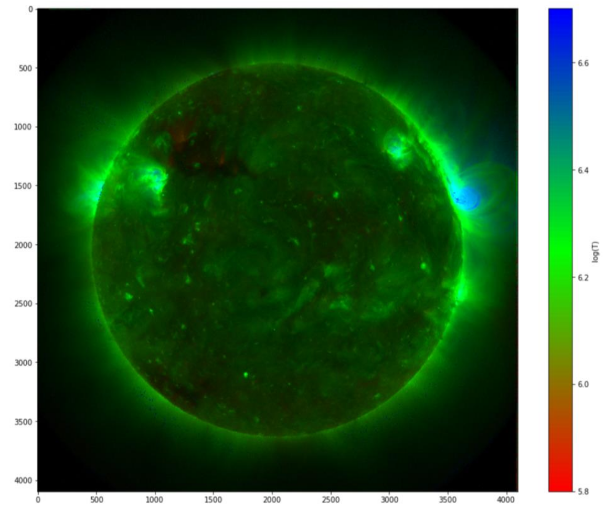

# HPC Assignment — Accelerating DEMREG

This assignment is based on the [DEMREG codebase](https://github.com/ianan/demreg),  
a scientific application written in Python with heavy use of NumPy.

---

## Scientific Background

The input to DEMREG consists of solar images from NASA’s Atmospheric Imaging Assembly (AIA) camera on board the Solar Dynamics Observatory (SDO).
This camera captures a full-disc image of the sun every 12 seconds in ten different wavelengths which give insight into the processes inside the solar atmosphere and the solar surface. 

For this project, six of those ten wavelengths are used because they give the best insight into the temperature of the sun.
For each pixel across these 6 bands, the code reconstructs the temperature distribution of the solar plasma.  
The result is a temperature map of the Sun derived from overlapping pixel intensities.

Full disk images of AIA in wavelenght 193Å (left), 131Å (right)

- A full image has a resolution of 4096 × 4096 pixels.  
- Computing the DEMREG solution for every pixel with plain Python/NumPy is extremely slow.  
- Since the problem is embarrassingly parallel, it can be accelerated with HPC techniques.  
- An even more challenging extension is to analyze a time series of images.

Output of the DEM algorithm in one image: a full disk temperature map of the sun with the emission weighted median temperature

---

## Goal of the Assignment

The goal is not simply to achieve the biggest speedup.  
What matters is to apply a proper engineering workflow:

- Profile and benchmark the baseline code  
- Analyze the problem and formulate hypotheses  
- Apply HPC techniques (see below)  
- Document the journey: design decisions, experiments, results  

---

## Environment

Start your work on [pub030.cs.technik.fhnw.ch](pub030.cs.technik.fhnw.ch).

If you require access to the FHNW Slurm Cluster, write an Email to [Manuel Stutz](mailto:manuel.stutz@fhnw.ch) and send your ed25519 public key to him. 

> Note: To generate an ed25519 key, use the following command: `ssh-keygen -t ed25519`. 

## Assessment and Grading

- 30% — Entry test (already fixed)  
- 20% — Quality of the assignment write-up  
  - Structure, clarity, and documentation  
  - Well-formed hypotheses and testing against them  
- 50% — Implemented speedup strategies  
  - May include multiple techniques or combined approaches  

---

## Group Work

You may work in groups of 2 to 4 students.  
- A group of 2 must implement at least 2 different strategies.  
- A group of 4 must implement at least 4 different strategies.  

Possible strategies include:  
- CPU vectorization (NumPy, Numba, exploiting CPU vector units)  
- GPU acceleration (CuPy, Numba CUDA)  
- MPI (multi-process, multi-GPU)  
- Dask (distributed arrays and dataframes on multi-GPU)  
- Hybrid approaches  

---

## Deliverables

Submit your work either:  
- As a Git repository (with access granted to `@UeliDeSchwert` and `@simonmarcin`), or  
- As a zip file containing your report and code base  

Your submission should include:  
- The code with your optimizations  
- A report (Markdown, PDF, or Notebook) documenting:  
  - Profiling and analysis of the baseline  
  - Implemented strategies and rationale  
  - Benchmark results and comparisons  
  - Reflections on what worked well, what did not, and why  

---

## Summary

This project combines a real scientific computing application with HPC techniques.  
You are expected to make use of CPU vector units, GPUs, MPI, and Dask, applying them in a structured way.  
The focus is on correctness, analysis, and engineering discipline — speedup numbers are secondary.
